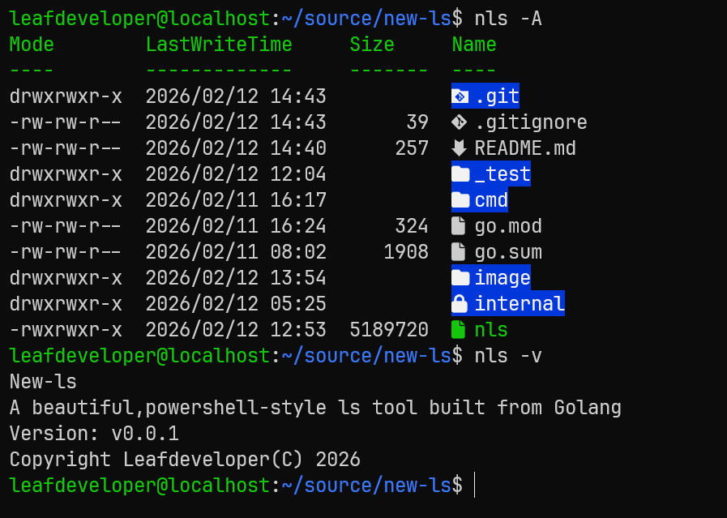

# New-ls

A beautiful,powershell 7-style new ls tool built from Golang

由Golang编写的一个漂亮的、powershell 7样式的新ls工具

>[!IMPORTANT]
>This repo is still under development; the current version is unstable

## TODO

- 优化文件大小显示，默认显示更加适合人阅读的以KB MB GB TB为单位的文件大小，如果用户额外加上了 `-b`参数，则输出原始的以字节为单位的大小

- 如果文件夹为空，normal output应该不输出任何东西
