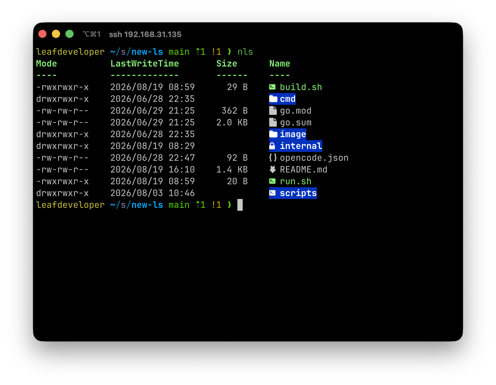

# New-ls

<div align="center">



A beautiful,powershell 7-style new ls tool built from Golang

由Golang编写的一个漂亮的、powershell 7样式的新ls工具
</div>

>[!IMPORTANT]
>This repo is still under development; the current version is unstable

## 安装 / Install

前往<a href="https://github.com/leaf2006/new-ls/releases">Release页面</a>下载对应架构，操作系统的nls的可执行程序

nls目前支持：

- Linux-amd64
- Linux-arm64
- Mac os (Apple Silicon)
- Mac os (Intel)
- Windows x86_64
- Windows x86

如果没有你的操作系统与架构，请Git clone本项目进行手动构建

## 用法 / Usage

```
nls [path...] [options]
```

不带路径时列出当前目录；可传入一个路径作为列出目标（目前仅取第一个参数）。

## 参数 / Options

| 参数 | 简写 | 说明 |
| --- | --- | --- |
| `--help` | `-h` | 显示帮助信息 |
| `--version` | `-v` | 仅输出版本信息 |
| `--simple` | `-s` | 简单模式：仅文件名 |
| `--All` | `-A` | 输出所有文件（包含隐藏文件） |
| `--byte` | `-b` | 以字节形式输出文件大小（在 `-s` 模式下不可用） |

## 示例 / Examples

```bash
nls                 # normal 输出当前目录
nls /path/to/dir    # 输出指定目录
nls -A              # 包含隐藏文件
nls -s              # 简单模式
nls -b              # 以字节形式显示文件大小
nls -v              # 输出版本信息
```

## 配置 / Config

nls的配置项应该放置在以下目录：
- Linux：~/.config/nls/config.json
- macOS：~/Library/Application Support/nls/config.json

示例：

```json
{
    "enable_icon": true,
    "byteOutput": false,
    "enable_all_file_output": true
}
```

配置项：

- enable_icon(bool)：是否启用图标显示（需要提前安装Nerd font字体），默认为true
- byteOutput(bool)：文件大小是否以字节形式输出，默认为false
- enable_all_file_output(bool)：是否默认输出隐藏文件，默认为false
- allways_simple_output(bool)：是否默认总是采用简单模式，默认为false
